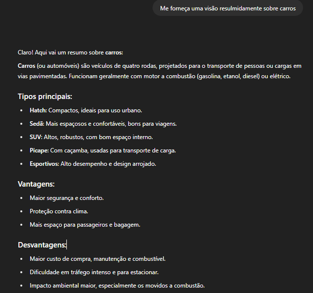
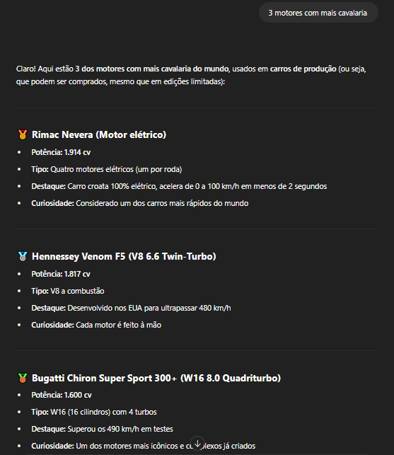
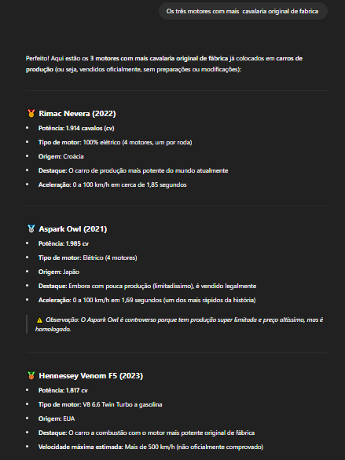
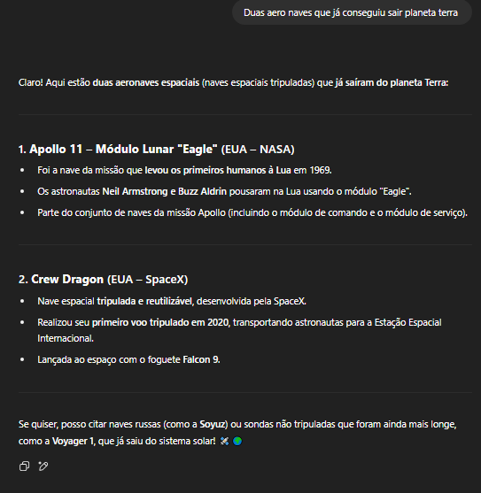

# Engenharia de Prompts

Projeto realizado junto com o grupo de estudos da proz

### O que é grande modelo de linguagem (LLM)?

  É um tipo de modelo de linguagem artificial, que tem a função de entender e gerar textos, linguagem essa que é treinada para dar continuidade em texto,  um LLM tentará         prever ou gerar a continuação mais provável desse texto com base no que                  aprendeu durante o treinamento.

### O que significa a sigla GPT?

GPT (generative pretrained transformer) , assim como o nome diz traduzindo transformador pré-treinado generativo, são uma família de modelos de redes neurais, que usa a arquitetura de transformadores e são um avanço fundamental na inteligência artificial (IA), os modelos GPT oferecem às aplicações a capacidade de criar texto e conteúdo semelhantes aos humanos.

### O que é Engenharia de Prompts?

A engenharia de prompts seria um tipo de linguagem,gerando prompts, ou como comandos, ajudando na linguagem do chat gpt, dando mais formalidade na resposta.

### Por que Engenharia de Prompts é crucial para Desenvolvedores de Sistemas?

Sem os Prompts não tem projeto, pois os Prompts são os comandos usados pelo desenvolvedor, comandos esses que são utilizados sempre, os pesquisadores usam a engenharia de prompts para melhorar a capacidade dos LLMs em uma ampla gama de tarefas comuns e complexas, sem eles não daria certo.

### Quais são os Princípios Fundamentais da Construção de Prompts?

A criação de um prompt pode ser bem complexa, na prática o prompt atua para configurar os pesos do modelo para concluir tarefas e trabalhos  desejados.

### Cite as principais Ferramentas de IA Generativa Relevantes para Desenvolvimento de Sistemas

 As principais ferramentas são chatGPT, copilot da microsoft, gemini do google, deepseek, perplexity, duky.IA.

## p2
### Retorne aos seus prompts da parte 1

### Escolha três prompts e aplique em cada um deles uma técnica de Engenharia de Prompt, deixando-o melhor
primeiro prompts "Me fale sobre carros resumidamente"
segundo prompts "3 motores com mais cavalaria"
terceiro prompts "2 foguetes que conseguiram ir para o espaço"

### Tire prints de todo o processo
PRIMEIRO

SEGUNDO 

TERCEIRO

### Para cada prompt, escreva as diferenças entre o prompt original e o prompt após a melhoria, indicando a técnica aplicada

Original "Me fale sobre carros resumidamente", após a melhoria, "Me forneça uma visão resulmidamente sobre carros", tecnica de engenharia de prompts ultilizado seria expecificação de texto,a diferencia seria nas informações que seria mais objetivas e mais bem entendidas.

Original "3 motores com mais cavalaria", após a melhoria "Os três motores com mais  cavalaria original de fabrica " tecnica de engenharia de prompts ultilizado seria expecificação de texto, os resultados não foram 100% iguais.

Original " 2 foguetes que conseguiram ir para o espaço ", após a melhoria "Duas aero naves que já conseguiu sair planeta terra ", tecnica de engenharia aplicada foi a expecificação de texto,os resultados não foram iguais,pois as duas aeronaves são diferentes.

### Monte seu markdown juntando as partes 1 e 3

### Crie um repositório no GitHub e publique seu markdown
